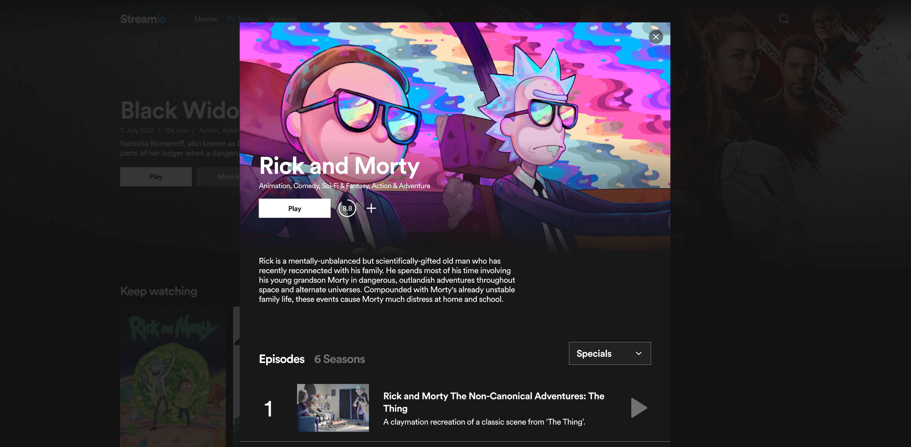

A small video streaming demo platform built with Next.js using a custom video player, providing a streaming example following the HLS protocol.

Check it out to explore all features (such as keep watching, watchlist, tv show season list, etc.): https://next-video-streaming-platform-hls.vercel.app

## Frontend
- React.js
- Next.js
- Typescript
- SASS
- Redux
- Hls.js

## API
The following api is being utilized: https://developers.themoviedb.org/3/getting-started/introduction

## Data Fetching
### Static Site Generation
Overview pages like "Home", "TV" and "Movie" are being pre-rendered on build and revalidated every hour (page visit premised), hence are extremely performant and barely have any loading time. 

### Clientside
Since every item's details shouldn't be fetched serverside and the application is using a pop-up for seamless user experience, item related details are fetched clientside on demand:
1. Prefetch on hover using redux async thunk
2. Url parameter with id on click to open popup
3. Get state if available, if not yet, wait for updated state



## HTTP Live Streaming
HTTP Live Streaming is an HTTP-based adaptive bitrate streaming communications protocol. It resembles MPEG-DASH in that it works by breaking the overall stream into a sequence of small HTTP-based file downloads, each downloading one short chunk of an overall potentially unbounded transport stream. A list of available streams, encoded at different bit rates, is sent to the client using an extended M3U playlist. [Read more.](https://en.wikipedia.org/wiki/HTTP_Live_Streaming)

## Custom Media Player
The application uses its own custom media player. Because of missing resources audio and subtitle selection are not included but could easily be implemented.


## Getting Started

Make sure to copy paste the `.env.public` contents to your local dotenv file and fill in the missing fields.

Then, run the development server:

```bash
npm run dev
# or
yarn dev
```

Open [http://localhost:3000](http://localhost:3000) with your browser to see the result.

The `pages/api` directory is mapped to `/api/*`. Files in this directory are treated as [API routes](https://nextjs.org/docs/api-routes/introduction) instead of React pages.
